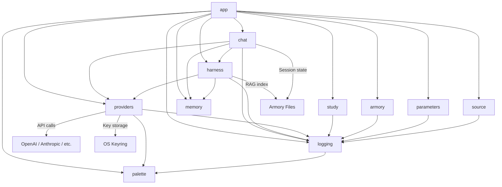

# Architecture

Hephaistos follows strict import boundaries enforced by `import-linter`. Only `app` may import from other packages; all other packages are forbidden from importing `app`.

## Dependency flow



The top layer is **app** (CLI shell, commands, workspace). Only **app** may import from
other packages. All other packages communicate through their public APIs and must not
import **app**. External services (LLM providers, OS keyring, armory files) are accessed
through the **providers** and **harness** layers only.

## Package layout

```
hephaistos/
  app/          CLI shell, commands, workspace, display — the top layer
  chat/         Engine, orchestrator, session, storage — no app imports
  harness/      Prompt building, persona, citation — no app imports
  providers/    LLM provider registry, config, auth — no app imports
  armory/       Armory data and commands — no app imports
  study/        Study controller — no app imports
  memory/       Memory extraction and storage — no app imports
  parameters/   Parameter management CLI — no app imports
  source/       Source management — no app imports
  logging.py    Shared logging — must NOT import app
  palette.py    ANSI color primitives — must NOT import app
```

## Import rules

### Forbidden: non-app packages must not import app

The following packages cannot import anything from `hephaistos.app`:

- `hephaistos.chat`
- `hephaistos.harness`
- `hephaistos.providers`
- `hephaistos.armory`
- `hephaistos.study`
- `hephaistos.memory`
- `hephaistos.parameters`
- `hephaistos.source`
- `hephaistos.logging`
- `hephaistos.palette`

### Forbidden: logging must not import app

`hephaistos.logging` must not import from `hephaistos.app`.

### Forbidden: app.commands must not import app.shell

`hephaistos.app.commands` must not import from `hephaistos.app.shell`.

### Independent: chat.session and chat.orchestrator

`hephaistos.chat.session` and `hephaistos.chat.orchestrator` must be independent at runtime (no direct runtime imports between them).

## Armory layout

An armory is a normal directory with a fixed layout:

```
my-armory/
  .hephaistos/
    armory.toml         # armory marker and metadata
    system_prompt.md    # optional custom system prompt (replaces default persona)
    history             # shell history for this armory (created on use)
    memory.json         # extracted study memory
    rag_index.json      # persisted retrieval index
    traces/             # per-session JSONL traces
    usage/              # per-session usage/cost snapshots
  source/               # primary study material, indexed for RAG
  library/              # additional reference material, indexed for RAG
  notes/                # workspace notes the agent can edit
  chats/                # saved chat sessions
  parameters/           # reserved workspace parameters directory
```

Only `source/` and `library/` are used for retrieval. Hidden files inside those directories are skipped by the indexer.
