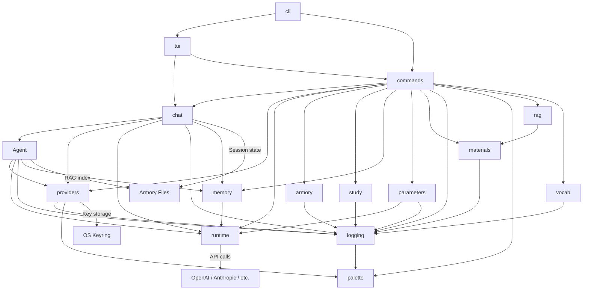
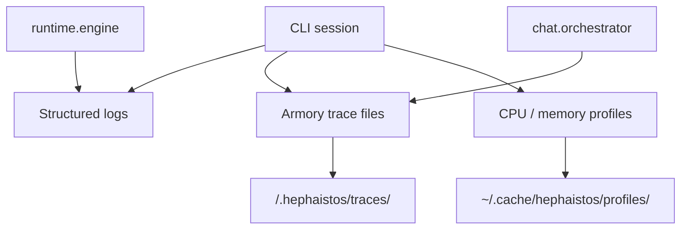

# Architecture

Heph follows strict import boundaries enforced by `import-linter`. Only
adapter packages may import broadly; lower tiers must stay copyable and must
not depend on product workflows.

## Architecture tiers

- **Core reusable packages**: `runtime`, `providers`, `logging`, `matching`,
  `terminal.palette`, `_types`. These are the most copyable packages and must
  not import product workflow packages.
- **Domain reusable packages**: `materials`, `rag`, `memory`, `armory`, `vocab`,
  `study`. These may model Heph concepts, but must not depend on
  adapters, CLI command handlers, TUI modules, or chat session orchestration.
- **Application services**: `chat` and focused workflow modules. These compose
  core/domain packages into session lifecycle, evidence, memory workflows, and
  turn orchestration.
- **Adapters**: `tui`, `cli`, `commands`, and terminal compatibility
  modules. The TUI is the human interface; the CLI is the command and automation
  skeleton. Adapters may depend broadly, but reusable decisions should be
  promoted into services or domain packages instead of staying in adapter code.

## Dependency flow



The top layer is the adapter surface: **tui**, **cli**, **commands**,
and **terminal**. `tui` is the primary interactive Textual interface; `cli` is
the public command dispatcher for launching the TUI, automation, and one-shot
commands. `commands` contains slash-command handlers, and `terminal` owns
low-level terminal I/O, styling, history, and command dispatch. Reusable packages communicate
through their public APIs and must not import adapter packages. Shared LLM
request primitives live in **runtime** so chat, agent, memory, parameters, and
providers do not import each other just to share message types or streaming
helpers.

## Package layout

```
hephaistos/
  cli/          Command and automation dispatcher; launches the TUI by default
  commands/     Slash-command handlers for TUI and automation adapters
  tui/          Textual interactive adapter: widgets, key handling, rendering
  terminal/     Terminal I/O, styling, prompts, history, command dispatch
  matching/     Fuzzy matching helpers for human-facing selectors
  chat/         Session lifecycle, storage, turn orchestration — no adapter imports
  runtime/      Shared LLM messages, config, client streaming, retry helpers
  agent/        Prompt building, citation, tools — no adapter imports
  providers/    LLM provider registry, config, auth — no adapter imports
  rag/          RAG chunking, indexing, retrieval — no adapter imports
  materials/    Study-file discovery, ignore rules, and material role classification
  armory/       Armory data and commands — no adapter imports
  study/        Study controller — no adapter imports
  memory/       Memory extraction and storage — no adapter imports
  parameters/   Parameter management CLI — no adapter imports
  privacy/      Consent, anonymous install ID, release-time diagnostics config
  diagnostics/  Anonymous events, local diagnostics, redacted crash reports
  vocab/        Vocabulary drill, scheduler, state — no adapter imports
  logging.py    Shared logging — must NOT import adapters
  terminal/palette.py  ANSI color primitives — must NOT import adapters
```

## Import rules

### Forbidden: reusable packages must not import adapters

The following packages cannot import anything from adapter packages:
`hephaistos.cli`, `hephaistos.commands`, `hephaistos.tui`,
`hephaistos.terminal.history` or `hephaistos.terminal.input`.

- `hephaistos.chat`
- `hephaistos.agent`
- `hephaistos.providers`
- `hephaistos.rag`
- `hephaistos.armory`
- `hephaistos.study`
- `hephaistos.memory`
- `hephaistos.parameters`
- `hephaistos.materials`
- `hephaistos.runtime`
- `hephaistos.vocab`
- `hephaistos.logging`
- `hephaistos.terminal.palette`
- `hephaistos.matching`

### Forbidden: logging and diagnostics must not import adapters

`hephaistos.logging` and `hephaistos.diagnostics.crashes` must not import from
`hephaistos.cli`, `hephaistos.commands`, or `hephaistos.tui`.

### Independent: chat.session and chat.orchestrator

`hephaistos.chat.session` and `hephaistos.chat.orchestrator` must be independent at runtime (no direct runtime imports between them).

### Independent: materials

`hephaistos.materials` owns material discovery and ignore-policy parsing.
It must not import `hephaistos.chat`, `hephaistos.agent`, or `hephaistos.rag`.
`hephaistos.rag` may import `materials`, but that dependency
is one-way.

### Low level: runtime

`hephaistos.runtime` owns shared LLM primitives such as `ChatConfig`,
`Conversation`, message conversion, client construction, streaming completion,
and retry helpers. It must not import adapters, `chat`, `agent`, `rag`, `study`,
`materials`, `memory`, or `armory`. Providers may be used by runtime, but
providers must not import product workflow packages.

### Core: providers

`hephaistos.providers` owns provider configuration, model catalogs, registry
metadata, and key resolution. It must not import adapters, `chat`, `agent`,
`rag`, `study`, or `materials`.

### Domain: memory and study

`hephaistos.memory` may use `runtime` to extract concepts, but it must not
import adapters, `chat`, or `agent`. `hephaistos.study` stays a pure
controller/state layer and must not import adapters, `chat`, `agent`, or `rag`.

## Armory layout

An armory is a normal directory with a fixed layout:

```
my-armory/
  .hephaistos/
    armory.toml         # armory marker and metadata
    system_prompt.md    # optional custom system prompt (replaces the default role prompt)
    history             # input history for this armory (created on use)
    memory.json         # extracted armory memory
    rag_index.json      # persisted retrieval index
    traces/             # per-session JSONL traces
    usage/              # per-session usage/cost snapshots
  materials/            # user study files, indexed for RAG
  parameters/           # reserved workspace parameters directory
```

Only `materials/` is used for retrieval. Hidden files inside that directory are
skipped by the materials scanner. `source` in citations or chunk metadata means
the provenance path for a retrieved chunk.

## Study memory

Heph is local-first by default: extracted study concepts are written to
`<armory>/.hephaistos/memory.json` and injected into future prompts so the
assistant can avoid repeating material the user already covered.

Memory stays armory-scoped. `/memory status` reports the active local store and
entry count for the current armory session.

## Diagnostics

Heph uses local diagnostics that keep debugging data inside the CLI
workflow and armory workspace.



### Structured logging

- Configure with `HEPHAISTOS_LOG_LEVEL`, `HEPHAISTOS_LOG_FILE`, and `HEPHAISTOS_LOG_FORMAT`
- Secrets are scrubbed before logs or trace files are written
- Interactive sessions default to human-readable output; non-interactive runs default to JSON

### Trace files

- Each armory can keep append-only JSONL traces in `.hephaistos/traces/`
- Trace files capture session events, retrieval activity, tool calls, and LLM timing
- Plain chat mode skips armory trace files unless a workspace is attached

### Profiling

- `--profile` flag: CPU profiling via cProfile (stdlib)
- `--profile-memory` flag: memory profiling via tracemalloc (stdlib)
- `py-spy` available in dev dependencies for flame graphs
- Profiles saved to `~/.cache/hephaistos/profiles/`

<!-- sync-docs:privacy-diagnostics-architecture:start -->
## Privacy & Diagnostics

Heph keeps privacy-impacting diagnostics optional and maintainer-facing.

- `hephaistos.diagnostics.events` sends anonymous PostHog events only when a backend is
  configured and the user explicitly opts in.
- `hephaistos.diagnostics.crashes` sends redacted Sentry crash reports only when a
  backend is configured and the user explicitly opts in.
- `hephaistos/privacy/release.py` is committed as a safe stub in the public
  repository. Official release and edge workflows overwrite it in CI before
  building artifacts.
- Source, editable, and Git installs stay bare by default. Forks and custom
  builds can wire their own endpoints with `HEPHAISTOS_POSTHOG_PROJECT_TOKEN`,
  `HEPHAISTOS_POSTHOG_HOST`, and `HEPHAISTOS_SENTRY_DSN`.
- Agents and contributors should preserve this split: diagnostics exist only for
  opt-in maintainer visibility into usage/errors and is never a required product
  dependency.
<!-- sync-docs:privacy-diagnostics-architecture:end -->

### Runbooks

Operational playbooks are in `docs/runbooks/`:
- [CI Failure](runbooks/ci-failure.md)
- [Slow LLM Response](runbooks/slow-llm-response.md)
- [Deployment Rollback](runbooks/deployment-rollback.md)
- [RAG Retrieval Issues](runbooks/rag-retrieval-issues.md)
