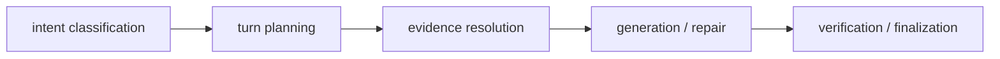
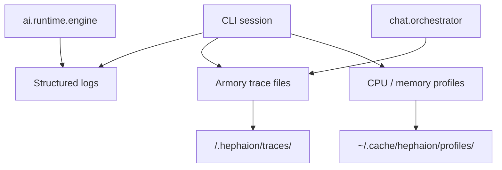

# Architecture

Heph uses five workspace packages with strict import boundaries.

```text
packages/
  heph/        The agent brain and user-facing command surface
  hephaion/    Harness implementation namespace
  ai/          Provider and model runtime
  interfaces/  Terminal/TUI adapters and theme tokens
  extensions/  Stable extension contracts
```

Each package has its own README for package-specific details. The root
`packages/README.md` stays intentionally short: it is a map of ownership and
dependency flow, not another architecture narrative.

## Package Ownership

- **Heph** owns the `heph` command, agent identity, research/talking
  orchestration, slash-command coordination, SDK surface, and composition of the
  lower packages. Lower packages must not import Heph.
- **The harness** lives in the `hephaion.*` implementation namespace. It owns
  turns, guardrails, grounding, citations, retrieval, armory state, memory,
  local learning attempts and policies, study workflows, diagnostics, and
  session persistence. It must not import Heph or interface adapters.
- **AI** owns provider configuration, auth, model catalogs, runtime streaming,
  retry, usage, prompt-cache request shaping, logging, diagnostics, and narrow
  payload type helpers. It lives under the `ai.*` Python namespace.
- **Interfaces** owns terminal/TUI presentation, input, source opening,
  transcript rendering, key handling, and `palette` theme tokens.
- **Extensions** owns small stable contracts for extension-oriented behavior.
  Concrete behavior belongs in the package that owns the runtime decision.

Heph and the harness are both protected, but in different ways: lower packages
cannot import Heph; adapters and app code compose the harness without owning its
correctness logic.

## Protected Core

The core should be hard to change accidentally and easy to extend deliberately.

- **AI is API substrate.** Treat `ai.*` like Pi's model API package: provider
  configuration, request/response normalization, streaming, retry, usage, and
  provider-neutral diagnostics. It should almost never change for Heph-specific
  behavior.
- **The harness owns correctness.** It guarantees local-document correctness
  through armory validation, retrieval, evidence selection, citation
  verification, guardrails, memory persistence, structural answer checks, and
  diagnostics. It should expose stable services instead of accumulating agent
  persona or interface behavior.
- **Heph is the brain.** Conversational strategy, research orchestration, Heph
  identity, and user-facing command composition belong here. The current
  `hephaion/agent` and `hephaion/chat` modules are migration-era harness
  surfaces; new agent-brain behavior should move toward Heph-facing modules and
  call the harness for validation rather than weakening the harness boundary.
- **The SDK is a UI-neutral Heph surface.** `heph.sdk` wraps the lower packages
  for native apps, GUI shells, automation, and future RPC transports. It must
  expose structured values and events instead of terminal output.
- **Extensions stay outside the core.** Optional behavior should attach through
  `extensions` contracts or adapter-level composition. Do not make extension
  behavior depend on editing AI, harness, or Heph internals.

## Dependency Flow

```mermaid
graph TD
    Heph["Heph agent"] --> Interfaces["Interfaces"]
    Heph --> Harness["Harness"]
    Heph --> AI["AI runtime"]
    Heph --> Extensions["Extensions"]
    Interfaces --> Harness
    Interfaces --> AI
    Interfaces --> Extensions
    Harness --> AI
    Harness --> Extensions
    Harness --> Materials["materials"]
    Harness --> RAG["rag"]
    Harness --> Study["study"]
    Harness --> Learning["learning"]
    Harness --> Memory["memory"]
    Harness --> AgentLoop["agent helpers"]
    RAG --> Materials
    AI --> LLM["LLM providers"]
    Harness --> FileStore["Armory files"]
```



Reusable packages communicate through public APIs. Interface code may compose
broadly because adapters must display many workflows, but reusable decisions
should move down into the harness, AI, Extensions, or Heph.

## Core harness flow

The correctness-critical chat flow follows a narrow reusable path:



- `chat.intent` owns the classifier schema, prompt contract, and payload parser.
  Intent handling must be structural and model-facing; it must not devolve into
  phrase-table semantic dispatch such as treating every greeting or overview
  wording as a separate code branch.
- `chat.turn_orchestrator` composes lifecycle, armory-turn setup, execution, and
  finalization mixins. `chat.orchestrator` keeps `TurnOrchestrator`,
  `iter_chat_events`, and `send_user_message` as public composition surfaces.
  Behavior-specific helpers should move into focused chat modules instead of
  growing the orchestrator.
- `chat.message_delivery` owns rendered one-shot sending, while
  `chat.session_persistence` owns session save behavior. This keeps
  `chat.session` and `chat.orchestrator` independent at runtime.
- `chat.evidence` owns retrieval resolution and assessment. Planning may request
  current, prior, or overview evidence, but it should not perform adapter work.
  Low-content filtering lives in `chat.evidence_text`; overview sampling lives
  in `chat.evidence_overview` so query retrieval, overview sampling, and
  assessment remain separate responsibilities.
- Generation and repair must remain grounded in `TurnEvidence`, citation
  verification, and structural reply checks before turn finalization records the
  result, usage, memory scheduling, and learning state changes.

## Package layout

```
packages/
  ai/
    src/ai/
      diagnostics/  Metrics and tracing primitives
      logging/      Structured logging, redaction, and timers
      providers/    LLM provider registry, config, auth, model catalogs
      runtime/      Chat config, messages, streaming, retry, usage
      types/        Narrow payload type helpers
    test/
  extensions/
    src/extensions/
      contracts.py  Stable extension contracts
    test/
  heph/
    src/heph/
      cli/        Console entrypoint and top-level subcommands
      commands/   Slash-command registry and command coordinators
      sdk/        Programmatic runtime/session surface for native apps and automation
      product/    Temporary self-knowledge bridge
      identity/   Stable self-description and conversational identity target
      prompts/    Prompt programs treated as code
      state/      Declarative JSON/Markdown state contract target
    test/
  hephaion/
    src/hephaion/
      agent/       Prompt building, citation, tool registry/handlers
      armory/      Armory data, validation, discovery, and local state helpers
      chat/        Session lifecycle, intent contracts, evidence, turn orchestration
      diagnostics/ Anonymous events, local diagnostics, redacted crash reports
      learning/    Structural answer-attempt observations and static guard policy
      matching/    Fuzzy matching helpers for human-facing selectors
      materials/   Study-file discovery, ignore rules, and material role classification
      memory/      Memory extraction and storage
      parameters/  Parameter management and settings
      privacy/     Consent, anonymous install ID, release-time diagnostics config
      rag/         RAG chunking, indexing, retrieval, source mapping
      safety/      Local safety contracts
      study/       Prompt plans, recall controller, priority analysis
      version/     Package version helpers
      vocab/       Vocabulary drill, scheduler, state
    test/
  interfaces/
    src/interfaces/
      palette/   Theme and ANSI color tokens
      terminal/  Terminal I/O, styling, prompts, history, source opening
      tui/       Textual adapter: lifecycle, widgets, inline menus, rendering
    test/
```

## Import rules

### Forbidden: reusable packages must not import adapters

The following packages cannot import anything from adapter packages:
`heph.cli`, `heph.commands`, `interfaces.tui`,
`interfaces.terminal.history` or `interfaces.terminal.input`.

- `hephaion.chat`
- `hephaion.agent`
- `ai.providers`
- `hephaion.rag`
- `hephaion.armory`
- `hephaion.learning`
- `hephaion.study`
- `hephaion.memory`
- `hephaion.parameters`
- `hephaion.materials`
- `ai.runtime`
- `hephaion.vocab`
- `interfaces.palette`
- `hephaion.matching`

### Forbidden: logging and diagnostics must not import adapters

`ai.logging` and `hephaion.diagnostics.crashes` must not import from
`heph.cli`, `heph.commands`, or `interfaces.tui`.

### Independent: chat.session and chat.orchestrator

`hephaion.chat.session` and `hephaion.chat.orchestrator` must be independent at
runtime (no direct runtime imports between them).

### Forbidden: Heph commands must not import TUI internals

`heph.commands` may produce terminal-friendly command results and coordinate
lower packages, but it must not import `interfaces.tui`. The TUI adapter may
call the command registry; command logic must not know TUI widgets, flows, or
keybindings.

### Independent: materials

`hephaion.materials` owns material discovery and ignore-policy parsing.
It must not import `hephaion.chat`, `hephaion.agent`, or `hephaion.rag`.
`hephaion.rag` may import `hephaion.materials`, but that dependency is one-way.

### Low level: runtime

`ai.runtime` owns shared LLM primitives such as `ChatConfig`,
`Conversation`, message conversion, client construction, streaming completion,
and retry helpers. It must not import adapters, `chat`, `agent`, `rag`, `study`,
`materials`, `memory`, or `armory` harness modules. Providers may be used by
runtime, but providers must not import Heph or harness workflow packages.

### Core: providers

`ai.providers` owns provider configuration, model catalogs, registry
metadata, and key resolution. It must not import adapters, `chat`, `agent`,
`rag`, `study`, or `materials`.

### Domain: memory and study

`hephaion.memory` may use `ai.runtime` to extract concepts, but it must not
import adapters, `hephaion.chat`, or `hephaion.agent`. `hephaion.study` stays a
pure controller/state layer and must not import adapters, `hephaion.chat`,
`hephaion.agent`, or `hephaion.rag`.

## Armory layout

An armory is a normal directory with a fixed layout:

```
my-armory/
  .hephaion/
    armory.toml         # armory marker and metadata
    system_prompt.md    # optional custom system prompt (replaces the default role prompt)
    history             # input history for this armory (created on use)
    memory.json         # extracted armory memory
    rag_index.json      # persisted retrieval index
    traces/             # per-session JSONL traces
    usage/              # per-session usage/cost snapshots
  materials/            # user study files, indexed for RAG
  parameters/           # reserved workspace parameters directory
```

Only `materials/` is used for retrieval. Hidden files inside that directory are
skipped by the materials scanner. `source` in citations or chunk metadata means
the provenance path for a retrieved chunk.

## Study memory

Heph is local-first by default: extracted study concepts are written to
`<armory>/.hephaion/memory.json` and injected into future prompts so the
assistant can avoid repeating material the user already covered.

Memory stays armory-scoped. `/status` includes the current armory session's
memory count when a local memory store is attached.

## Diagnostics

Heph uses local diagnostics that keep debugging data inside the CLI workflow
and armory workspace.



### Structured logging

- Configure with `HEPHAION_LOG_LEVEL`, `HEPHAION_LOG_FILE`, and `HEPHAION_LOG_FORMAT`
- Secrets are scrubbed before logs or trace files are written
- Interactive sessions default to human-readable output; non-interactive runs default to JSON

### Trace files

- Each armory can keep append-only JSONL traces in `.hephaion/traces/`
- Trace files capture session events, user messages, retrieval activity, retrieved
  excerpts, material/tool metadata, and LLM timing
- Trace files are local armory data; recognized secrets are redacted before writing,
  but trace contents should still be treated as private when sharing an armory
- Plain chat mode skips armory trace files unless a workspace is attached

### Profiling

- `--profile` flag: CPU profiling via cProfile (stdlib)
- `--profile-memory` flag: memory profiling via tracemalloc (stdlib)
- `py-spy` available in dev dependencies for flame graphs
- Profiles saved to `~/.cache/hephaion/profiles/`

<!-- sync-docs:privacy-diagnostics-architecture:start -->
## Privacy & Diagnostics

Heph keeps privacy-impacting diagnostics optional and maintainer-facing.

- `diagnostics.events` sends anonymous PostHog events only when a backend is
  configured and the user explicitly opts in.
- `diagnostics.crashes` sends redacted Sentry crash reports only when a
  backend is configured and the user explicitly opts in.
- `packages/hephaion/src/hephaion/privacy/release.py` is committed as a safe stub in the public
  repository. Official release and edge workflows overwrite it in CI before
  building artifacts.
- Source, editable, and Git installs stay bare by default. Forks and custom
  builds can wire their own endpoints with `HEPHAION_POSTHOG_PROJECT_TOKEN`,
  `HEPHAION_POSTHOG_HOST`, and `HEPHAION_SENTRY_DSN`.
- Agents and contributors should preserve this split: diagnostics exist only for
  opt-in maintainer visibility into usage/errors and is never a required product
  dependency.
<!-- sync-docs:privacy-diagnostics-architecture:end -->

### Runbooks

Operational playbooks are in `docs/runbooks/`:
- [CI Failure](runbooks/ci-failure.md)
- [Slow LLM Response](runbooks/slow-llm-response.md)
- [Deployment Rollback](runbooks/deployment-rollback.md)
- [RAG Retrieval Issues](runbooks/rag-retrieval-issues.md)
