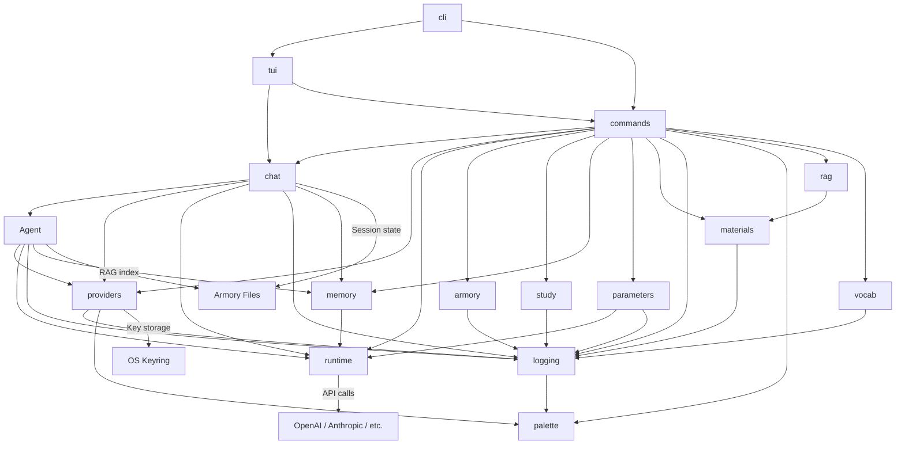
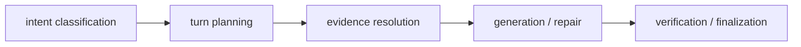
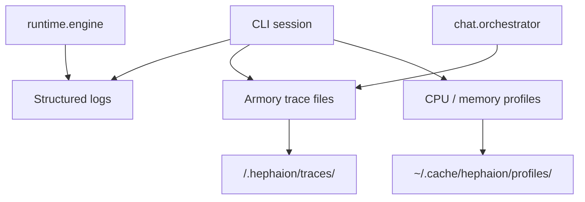

# Architecture

Hephaion follows strict import boundaries enforced by `import-linter`. Source
packages live under `packages/` so stable product ownership is separated from
extension surfaces. Only adapter packages may import broadly; lower tiers must
stay copyable and must not depend on product workflows.

## Package ownership

The target package root mirrors the Pi-style split between the agent identity,
the harness, and extensible surfaces:

```
packages/
  heph/        Model-facing identity, self-knowledge, prompt contracts, state
    identity/  Stable self-description and conversational identity
    prompts/   Prompt programs treated as code
    state/     Declarative JSON/Markdown state contracts
  hephaion/    Correctness harness, retrieval, citations, runtime, persistence
  interfaces/  User-facing shells and integrations such as TUI/CLI surfaces
  extensions/  User-extensible workflows, tools, prompts, and integrations
```

`packages/hephaion` is the current importable `hephaion` package.
`heph`, `interfaces`, and `extensions` are migration roots. Moving code into them
must preserve the product promise: Heph is the thing the user talks to, while
Hephaion is the harness that prepares context, runs loops, validates grounding,
streams events, records state, and persists sessions.

The long-term goal is a closed kernel with an open extension plane. Heph and
Hephaion should know their own contracts well enough that a user can ask Heph to
add, remove, or adapt behavior through extension points. The user should not
need every personal workflow built into the core. Extension code can add tools,
prompts, workflows, or interface affordances, but it must compose stable
contracts instead of bypassing grounding, citation verification, memory scope, or
session persistence.

Heph-facing behavior should be open for extension through prompt/state files.
It should not learn about TUI keybindings, terminal details, provider internals,
or one-off phrase lists. Hephaion may enforce structure around Heph, but it
should not hardcode semantic dispatch for every possible user phrase.

## Architecture tiers

- **Heph target package**: `heph`. This owns the future model-facing identity,
  self-knowledge, prompt programs, and declarative state contracts.
- **Core reusable packages**: `runtime`, `providers`, `logging`, `matching`,
  `terminal.palette`, `_types`. These are the most copyable packages and must
  not import product workflow packages.
- **Domain reusable packages**: `materials`, `rag`, `memory`, `armory`, `vocab`,
  `study`. These may model Heph agent concepts, but must not depend on
  adapters, CLI command handlers, TUI modules, or chat session orchestration.
- **Application services**: `chat` and focused workflow modules. These compose
  core/domain packages into session lifecycle, evidence, memory workflows, and
  turn orchestration.
- **Interfaces**: `tui`, `cli`, `commands`, and terminal compatibility
  modules. The TUI is the human interface; the CLI is the command and automation
  skeleton. Interface packages may depend broadly, but reusable decisions should be
  promoted into services or domain packages instead of staying in adapter code.
  Interface modes should expose the same harness as interactive TUI,
  print/plain CLI, JSON streaming, and future RPC/process integration surfaces
  without duplicating core routing, validation, or extension decisions.
- **Extension targets**: `packages/extensions` and future interface packages.
  User-modifiable behavior should depend on stable contracts, not modify Heph
  identity or Hephaion harness internals directly. If a requested capability is
  user-specific and not part of the correctness harness, prefer an extension seam
  over another built-in branch.

## Dependency flow



The top layer is the interface surface: **tui**, **cli**, **commands**,
and **terminal**. `tui` is the primary interactive Textual interface; `cli` is
the public command dispatcher for launching the TUI, automation, and one-shot
commands. `commands` contains slash-command handlers, and `terminal` owns
low-level terminal I/O, styling, history, and command dispatch. Reusable packages communicate
through their public APIs and must not import adapter packages. Shared LLM
request primitives live in **runtime** so chat, agent, memory, parameters, and
providers do not import each other just to share message types or streaming
helpers.

## Core harness flow

The correctness-critical chat harness follows a narrow reusable flow:



- `chat.intent` owns the classifier schema, prompt contract, and payload parser.
  Intent handling must be structural and model-facing; it must not devolve into
  phrase-table semantic dispatch such as treating every greeting or overview
  wording as a separate code branch.
- `chat.turn_orchestrator` composes lifecycle, armory-turn setup, execution, and
  finalization mixins. `chat.orchestrator` keeps `TurnOrchestrator`,
  `iter_chat_events`, and `send_user_message` as public composition surfaces.
  Behavior-specific helpers should move into focused chat modules instead of
  growing the orchestrator.
- `chat.message_delivery` owns rendered one-shot sending, while
  `chat.session_persistence` owns session save behavior. This keeps
  `chat.session` and `chat.orchestrator` independent at runtime.
- `chat.evidence` owns retrieval resolution and assessment. Planning may request
  current, prior, or overview evidence, but it should not perform adapter work.
  Low-content filtering lives in `chat.evidence_text`; overview sampling lives
  in `chat.evidence_overview` so query retrieval, overview sampling, and
  assessment remain separate responsibilities.
- Generation and repair must remain grounded in `TurnEvidence`, citation
  verification, and structural reply checks before turn finalization records the
  result, usage, memory scheduling, and learning state changes.

Interfaces follow the same split as the Codex Rust layout: core services stay
reusable, while TUI/CLI/command surfaces compose them. TUI frame behavior such
as resize handling and terminal protocol support lives in `tui.resize`;
external slash-command and managed-resend execution lives in
`tui.external_commands`; generic inline-menu rendering/filtering lives in
`tui.inline_menu`; model picker label parsing lives in `tui.model_flow`.
Study prompt construction and turn-plan contracts live in `study.prompt_plans`,
while `study.controller` keeps learning routing and state transitions.
Priority scan orchestration remains in `study.priority`; analysis, progress,
web search, report, and rendering details live in focused priority modules.
Plugin registry and dynamic armory tool loading lives in `agent.tool_registry`.

## Package layout

```
packages/
  heph/        Target model-facing package for Heph identity and prompt state
    identity/  Stable self-description and conversational identity
    prompts/   Prompt programs treated as code
    state/     Declarative JSON/Markdown state contracts
  interfaces/  Target package root for user-facing shells and integrations
  extensions/  Target package root for user-extensible behavior
  hephaion/
    cli/          Command and automation dispatcher; launches the TUI by default
    commands/     Slash-command handlers for TUI and automation interfaces
    tui/          Textual adapter: lifecycle, widgets, inline menus, rendering
    terminal/     Terminal I/O, styling, prompts, history, command dispatch
    matching/     Fuzzy matching helpers for human-facing selectors
    chat/         Session lifecycle, intent contracts, evidence, turn orchestration
    runtime/      Shared LLM config, messages, errors, deltas, client streaming, retry helpers
    agent/        Prompt building, citation, tool registry/handlers
    providers/    LLM provider registry, config, auth
    rag/          RAG chunking, indexing, retrieval
    materials/    Study-file discovery, ignore rules, and material role classification
    armory/       Armory data and commands
    study/        Prompt plans, learning controller, priority analysis
    memory/       Memory extraction and storage
    parameters/   Parameter management CLI
    privacy/      Consent, anonymous install ID, release-time diagnostics config
    diagnostics/  Anonymous events, local diagnostics, redacted crash reports
    vocab/        Vocabulary drill, scheduler, state
    logging.py    Shared logging — must NOT import adapters
    terminal/palette.py  ANSI color primitives — must NOT import adapters
```

## Import rules

### Forbidden: reusable packages must not import adapters

The following packages cannot import anything from adapter packages:
`hephaion.cli`, `hephaion.commands`, `hephaion.tui`,
`hephaion.terminal.history` or `hephaion.terminal.input`.

- `hephaion.chat`
- `hephaion.agent`
- `hephaion.providers`
- `hephaion.rag`
- `hephaion.armory`
- `hephaion.study`
- `hephaion.memory`
- `hephaion.parameters`
- `hephaion.materials`
- `hephaion.runtime`
- `hephaion.vocab`
- `hephaion.logging`
- `hephaion.terminal.palette`
- `hephaion.matching`

### Forbidden: logging and diagnostics must not import adapters

`hephaion.logging` and `hephaion.diagnostics.crashes` must not import from
`hephaion.cli`, `hephaion.commands`, or `hephaion.tui`.

### Independent: chat.session and chat.orchestrator

`hephaion.chat.session` and `hephaion.chat.orchestrator` must be independent at runtime (no direct runtime imports between them).

### Independent: materials

`hephaion.materials` owns material discovery and ignore-policy parsing.
It must not import `hephaion.chat`, `hephaion.agent`, or `hephaion.rag`.
`hephaion.rag` may import `materials`, but that dependency
is one-way.

### Low level: runtime

`hephaion.runtime` owns shared LLM primitives such as `ChatConfig`,
`Conversation`, message conversion, client construction, streaming completion,
and retry helpers. It must not import adapters, `chat`, `agent`, `rag`, `study`,
`materials`, `memory`, or `armory`. Providers may be used by runtime, but
providers must not import product workflow packages.

### Core: providers

`hephaion.providers` owns provider configuration, model catalogs, registry
metadata, and key resolution. It must not import adapters, `chat`, `agent`,
`rag`, `study`, or `materials`.

### Domain: memory and study

`hephaion.memory` may use `runtime` to extract concepts, but it must not
import adapters, `chat`, or `agent`. `hephaion.study` stays a pure
controller/state layer and must not import adapters, `chat`, `agent`, or `rag`.

## Armory layout

An armory is a normal directory with a fixed layout:

```
my-armory/
  .hephaion/
    armory.toml         # armory marker and metadata
    system_prompt.md    # optional custom system prompt (replaces the default role prompt)
    history             # input history for this armory (created on use)
    memory.json         # extracted armory memory
    rag_index.json      # persisted retrieval index
    traces/             # per-session JSONL traces
    usage/              # per-session usage/cost snapshots
  materials/            # user study files, indexed for RAG
  parameters/           # reserved workspace parameters directory
```

Only `materials/` is used for retrieval. Hidden files inside that directory are
skipped by the materials scanner. `source` in citations or chunk metadata means
the provenance path for a retrieved chunk.

## Study memory

Hephaion is local-first by default: extracted study concepts are written to
`<armory>/.hephaion/memory.json` and injected into future prompts so the
assistant can avoid repeating material the user already covered.

Memory stays armory-scoped. `/status` includes the current armory session's
memory count when a local memory store is attached.

## Diagnostics

Hephaion uses local diagnostics that keep debugging data inside the CLI
workflow and armory workspace.



### Structured logging

- Configure with `HEPHAION_LOG_LEVEL`, `HEPHAION_LOG_FILE`, and `HEPHAION_LOG_FORMAT`
- Secrets are scrubbed before logs or trace files are written
- Interactive sessions default to human-readable output; non-interactive runs default to JSON

### Trace files

- Each armory can keep append-only JSONL traces in `.hephaion/traces/`
- Trace files capture session events, user messages, retrieval activity, retrieved
  excerpts, material/tool metadata, and LLM timing
- Trace files are local armory data; recognized secrets are redacted before writing,
  but trace contents should still be treated as private when sharing an armory
- Plain chat mode skips armory trace files unless a workspace is attached

### Profiling

- `--profile` flag: CPU profiling via cProfile (stdlib)
- `--profile-memory` flag: memory profiling via tracemalloc (stdlib)
- `py-spy` available in dev dependencies for flame graphs
- Profiles saved to `~/.cache/hephaion/profiles/`

<!-- sync-docs:privacy-diagnostics-architecture:start -->
## Privacy & Diagnostics

Hephaion keeps privacy-impacting diagnostics optional and maintainer-facing.

- `hephaion.diagnostics.events` sends anonymous PostHog events only when a backend is
  configured and the user explicitly opts in.
- `hephaion.diagnostics.crashes` sends redacted Sentry crash reports only when a
  backend is configured and the user explicitly opts in.
- `packages/hephaion/privacy/release.py` is committed as a safe stub in the public
  repository. Official release and edge workflows overwrite it in CI before
  building artifacts.
- Source, editable, and Git installs stay bare by default. Forks and custom
  builds can wire their own endpoints with `HEPHAION_POSTHOG_PROJECT_TOKEN`,
  `HEPHAION_POSTHOG_HOST`, and `HEPHAION_SENTRY_DSN`.
- Agents and contributors should preserve this split: diagnostics exist only for
  opt-in maintainer visibility into usage/errors and is never a required product
  dependency.
<!-- sync-docs:privacy-diagnostics-architecture:end -->

### Runbooks

Operational playbooks are in `docs/runbooks/`:
- [CI Failure](runbooks/ci-failure.md)
- [Slow LLM Response](runbooks/slow-llm-response.md)
- [Deployment Rollback](runbooks/deployment-rollback.md)
- [RAG Retrieval Issues](runbooks/rag-retrieval-issues.md)
