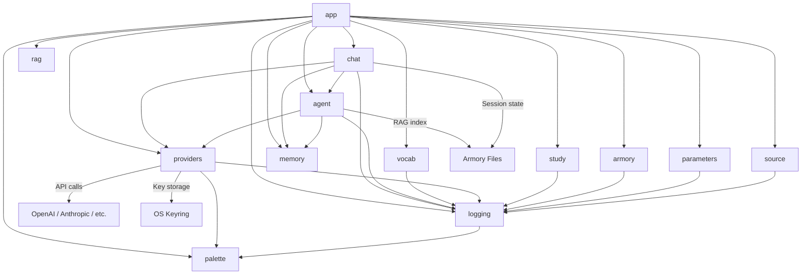
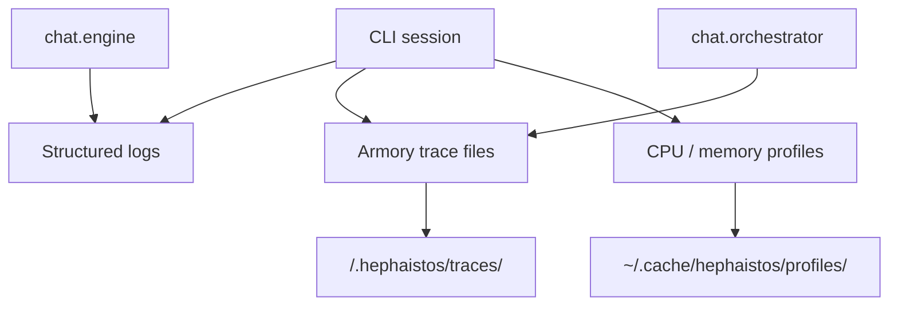

# Architecture

Hephaistos follows strict import boundaries enforced by `import-linter`. Only `app` may import from other packages; all other packages are forbidden from importing `app`.

## Dependency flow



The top layer is **app** (CLI, commands, workspace). Only **app** may import from
other packages. All other packages communicate through their public APIs and must not
import **app**. External services (LLM providers, OS keyring, armory files) are accessed
through the **providers** and **agent** layers only.

## Package layout

```
hephaistos/
  app/          CLI, commands, workspace, display — the top layer
  chat/         Engine, orchestrator, session, storage — no app imports
  agent/        Prompt building, persona, citation, tools — no app imports
  providers/    LLM provider registry, config, auth — no app imports
  rag/          RAG chunking, indexing, retrieval — no app imports
  armory/       Armory data and commands — no app imports
  study/        Study controller — no app imports
  memory/       Memory extraction and storage — no app imports
  parameters/   Parameter management CLI — no app imports
  source/       Source management — no app imports
  vocab/        Vocabulary drill, scheduler, state — no app imports
  logging.py    Shared logging — must NOT import app
  palette.py    ANSI color primitives — must NOT import app
```

## Import rules

### Forbidden: non-app packages must not import app

The following packages cannot import anything from `hephaistos.app`:

- `hephaistos.chat`
- `hephaistos.agent`
- `hephaistos.providers`
- `hephaistos.rag`
- `hephaistos.armory`
- `hephaistos.study`
- `hephaistos.memory`
- `hephaistos.parameters`
- `hephaistos.source`
- `hephaistos.vocab`
- `hephaistos.logging`
- `hephaistos.palette`

### Forbidden: logging must not import app

`hephaistos.logging` must not import from `hephaistos.app`.

### Independent: chat.session and chat.orchestrator

`hephaistos.chat.session` and `hephaistos.chat.orchestrator` must be independent at runtime (no direct runtime imports between them).

## Armory layout

An armory is a normal directory with a fixed layout:

```
my-armory/
  .hephaistos/
    armory.toml         # armory marker and metadata
    system_prompt.md    # optional custom system prompt (replaces default persona)
    history             # shell history for this armory (created on use)
    memory.json         # extracted study memory
    rag_index.json      # persisted retrieval index
    traces/             # per-session JSONL traces
    usage/              # per-session usage/cost snapshots
  source/               # primary study material, indexed for RAG
  library/              # additional reference material, indexed for RAG
  notes/                # workspace notes the agent can edit
  chats/                # saved chat sessions
  parameters/           # reserved workspace parameters directory
```

Only `source/` and `library/` are used for retrieval. Hidden files inside those directories are skipped by the indexer.

## Study memory

Hephaistos is local-first by default: extracted study concepts are written to
`<armory>/.hephaistos/memory.json` and injected into future prompts so the
assistant can avoid repeating material the user already covered.

Users can opt in to Supermemory through `/memory setup`. When enabled,
Hephaistos writes extracted concepts to an armory-specific Supermemory
container tag and to a dedicated global study profile tag. This gives semantic
recall across armories while keeping setup explicit and reversible. If
Supermemory is disabled, unconfigured, or unavailable, session creation falls
back to the local JSON memory store.

## Diagnostics

Hephaistos uses local diagnostics that keep debugging data inside the CLI
workflow and armory workspace.



### Structured logging

- Configure with `HEPHAISTOS_LOG_LEVEL`, `HEPHAISTOS_LOG_FILE`, and `HEPHAISTOS_LOG_FORMAT`
- Secrets are scrubbed before logs or trace files are written
- Interactive sessions default to human-readable output; non-interactive runs default to JSON

### Trace files

- Each armory can keep append-only JSONL traces in `.hephaistos/traces/`
- Trace files capture session events, retrieval activity, tool calls, and LLM timing
- Plain chat mode skips armory trace files unless a workspace is attached

### Profiling

- `--profile` flag: CPU profiling via cProfile (stdlib)
- `--profile-memory` flag: memory profiling via tracemalloc (stdlib)
- `py-spy` available in dev dependencies for flame graphs
- Profiles saved to `~/.cache/hephaistos/profiles/`

<!-- sync-docs:telemetry-architecture:start -->
## Telemetry

Hephaistos keeps telemetry optional and maintainer-facing.

- `hephaistos.analytics` sends anonymous PostHog events only when a backend is
  configured and the user explicitly opts in.
- `hephaistos.observability` sends redacted Sentry crash reports only when a
  backend is configured and the user explicitly opts in.
- `hephaistos/_telemetry_release.py` is committed as a safe stub in the public
  repository. Official release and edge workflows overwrite it in CI before
  building artifacts.
- Source, editable, and Git installs stay bare by default. Forks and custom
  builds can wire their own endpoints with `HEPHAISTOS_POSTHOG_PROJECT_TOKEN`,
  `HEPHAISTOS_POSTHOG_HOST`, and `HEPHAISTOS_SENTRY_DSN`.
- Agents and contributors should preserve this split: telemetry exists only for
  opt-in maintainer visibility into usage/errors and is never a required product
  dependency.
<!-- sync-docs:telemetry-architecture:end -->

### Runbooks

Operational playbooks are in `docs/runbooks/`:
- [CI Failure](runbooks/ci-failure.md)
- [Slow LLM Response](runbooks/slow-llm-response.md)
- [Deployment Rollback](runbooks/deployment-rollback.md)
- [RAG Retrieval Issues](runbooks/rag-retrieval-issues.md)
