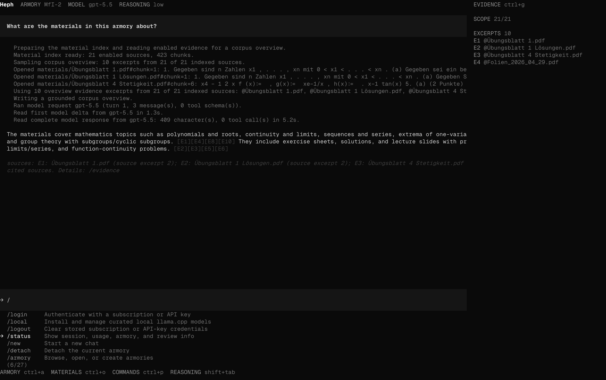

<!-- Managed by scripts/sync_docs.py. Do not edit directly. -->

<p align="center">
  
</p>

<p align="center">
  <a href="https://pypi.org/project/heph/"></a>
  <a href="#installation"></a>
  <a href="../LICENSE"></a>
</p>

Heph is an agentic local document harness for accurate, cited answers. It
indexes armory materials, cites retrieved evidence, and keeps learning memory
scoped to that armory.

<p align="center">
  
</p>

## Quick Start

```bash
# Install UV (if not already installed)
curl -LsSf https://astral.sh/uv/install.sh | sh

# Install Heph
uv tool install heph@latest

# Create a workspace for your files
heph armory init [name]

# Add documents, notes, or code that Heph can answer from
cp ~/Downloads/[file] ~/.armories/[name]/materials/

# Start Heph in that armory
heph [name]
```

## The armory is the interface

A typical Heph armory has this structure:

```text
~/.armories/[name]/
├── materials/            # PDFs, Office docs, notes, code to cite
│   ├── [file].pdf
│   └── [file].md
├── .harness/             # Local Heph state
│   ├── armory.toml       # Armory marker
│   ├── rag_index.json    # Retrieval index
│   ├── memory.json       # Learning memory
│   ├── chats/            # Saved sessions
│   ├── traces/           # JSONL traces when enabled
│   ├── usage/            # Token and cost snapshots
│   └── ignore            # Indexing ignore rules
└── README.md             # Armory notes
```

Heph reads `materials/`, writes local state under `.harness/`, and leaves the
armory portable. Read [Armories](armories.md) for storage, indexing, and memory
details.

Copy or sync `.armories` to move work between machines; set provider credentials
again on each machine.

## Installation

> [!NOTE]
> Heph is currently in beta, so unexpected issues may occur. Please report them if
> they have not already been reported.

### Using UV (recommended)

Install UV:

```bash
curl -LsSf https://astral.sh/uv/install.sh | sh
```

Then Heph:

```bash
uv tool install heph@latest
```

### Using Pip

```bash
pip install heph
```

### Updating

```bash
heph update
```

Check the installed version:

```bash
heph --version
```

## Docs

- [Getting started](getting-started.md): first armory, first answer
- [Armories](armories.md): layout, portability, memory
- [CLI reference](cli-reference.md): commands, shortcuts, env vars
- [Configuration](configuration.md): providers, models, settings
- [Models](models.md): provider choices and API keys
- [Trust and ownership](trust.md): data, cache, prompts, compute
- [Privacy](privacy.md): local state, diagnostics, network behavior
- [Architecture](architecture.md): harness, package boundaries, flow
- [SDK](sdk.md): native apps, GUI shells, automation
- [Troubleshooting](troubleshooting.md): setup, indexing, providers
- [Developers](developers.md): internal docs
- [Runbooks](runbooks.md): operational debugging
- [Contributing](../CONTRIBUTING.md): repo layout and local workflow

## Contributing

See [CONTRIBUTING.md](../CONTRIBUTING.md) for local development, tests, and pull request
guidelines.

## Safety

Analytics and crash reporting are opt-in from `/settings`. Source and Git installs do
not enable hosted diagnostics by default.

Model-generated terminal commands are not exposed as a default agent tool. Explicit
`!` terminal escapes and armory plugins should only be used in armories you trust.
