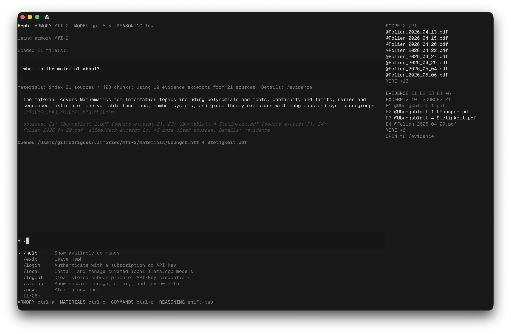

<!-- Managed by scripts/sync_docs.py. Do not edit directly. -->

<p align="center">
  
</p>

<h1 align="center">Heph</h1>

<p align="center">
  <a href="https://pypi.org/project/heph/"></a>
  <a href="#quick-start"></a>
  <a href="../LICENSE"></a>
</p>

Local document workspace for accurate, cited answers from files you keep in
normal folders. Heph indexes armory materials, cites retrieved evidence, and
keeps learning memory scoped to that armory.

<p align="center">
  
</p>

## The armory is the interface

A typical Heph armory has this structure:

```text
~/.armories/exams/
├── materials/              # PDFs, Office docs, notes, code to cite
│   ├── lecture-notes.pdf
│   └── reference.md
├── .hephaion/              # Local Heph state
│   ├── armory.toml         # Armory marker
│   ├── rag_index.json      # Retrieval index
│   ├── memory.json         # Learning memory
│   ├── chats/              # Saved sessions
│   ├── traces/             # Optional JSONL traces
│   ├── usage/              # Token and cost snapshots
│   └── ignore              # Optional indexing ignores
└── README.md               # Optional notes
```

Heph reads `materials/`, writes local state under `.hephaion/`, and leaves the
armory portable. Read [Armories](armories.md) for storage, indexing, and memory
details.

> [!NOTE]
> Named armories live in `~/.armories`. Copy or sync that folder to move work
> between machines; set provider credentials again on each machine.

## Quick Start

```bash
uv tool install heph@latest
heph armory init exams
cp ~/Downloads/lecture-notes.pdf ~/.armories/exams/materials/
heph exams
```

If you do not use uv:

```bash
pip install heph
heph armory init exams
cp ~/Downloads/lecture-notes.pdf ~/.armories/exams/materials/
heph exams
```

## Commands

```text
heph [name-or-path]     Open Heph.
heph armory init NAME   Create an armory in ~/.armories.
heph index [path]       Refresh the materials index.
heph health [path]      Check indexed materials.
heph local status       Show local llama.cpp status.
heph sdk serve          Start the JSONL SDK service.
heph update             Show the update command.
```

Inside Heph: `/login`, `/models`, `/local`, `/armory`, `/materials`,
`/evidence`, `/turn`, `/settings`, `/keymap`, and `/exit`.

## Docs

- [Getting started](getting-started.md): first armory, first answer
- [Armories](armories.md): layout, portability, memory
- [CLI reference](cli-reference.md): commands, shortcuts, env vars
- [Configuration](configuration.md): providers, models, settings
- [Models](models.md): provider choices and API keys
- [Privacy](privacy.md): local state, diagnostics, network behavior
- [Architecture](architecture.md): harness, package boundaries, flow
- [SDK](developers/sdk.md): native apps, GUI shells, automation
- [Troubleshooting](troubleshooting.md): setup, indexing, providers
- [Developers](developers/index.md): internal docs
- [Runbooks](developers/runbooks/index.md): operational debugging
- [Contributing](../CONTRIBUTING.md): repo layout and local workflow

## Contributing

See [CONTRIBUTING.md](../CONTRIBUTING.md) for local development, tests, and pull request
guidelines.

## Safety

Analytics and crash reporting are opt-in from `/settings`. Source and Git installs do
not enable hosted diagnostics by default.

Model-generated terminal commands are not exposed as a default agent tool. Explicit
`!` terminal escapes and armory plugins should only be used in armories you trust.
