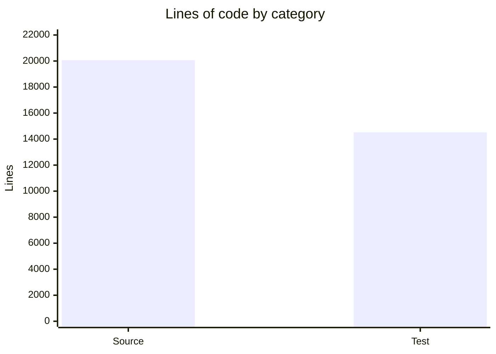

# By the numbers

_Data collected on 2026-04-28._

## Size

| Metric | Value |
|---|---|
| Source lines of code (Python) | 20,058 |
| Test lines of code (Python) | 14,522 |
| **Total lines of code** | **34,580** |
| Source files | 78 |
| Test files | 61 |
| **Total files** | **139** |
| Packages | 1 |



## Activity

~200 commits total across the lifetime of the project.

| Month | Commits |
|---|---|
| Feb 2026 | 19 |
| Mar 2026 | 13 |
| Apr 2026 | 171 |

April 2026 was the burst — the majority of the codebase as it exists today was written or rewritten during that month.

### Most active directories

| Directory | Files | Notes |
|---|---|---|
| `hephaistos/app/` | 18 | Highest churn — CLI commands, TUI, shell |
| `hephaistos/harness/` | 13 | Agent loop, RAG pipeline |
| `hephaistos/chat/` | 12 | LLM engine, streaming, message handling |

## Bot-attributed commits

| Author | Commits |
|---|---|
| Gil | ~182 |
| devin-ai-integration[bot] | 4 |
| dependabot[bot] | 1 |
| T3 Code (external contributor) | 7 |

These counts are lower bounds on AI-assisted work — many human-attributed commits likely involved AI assistance that isn't visible in the git log.

## Complexity

### Largest source files

| File | Lines |
|---|---|
| `hephaistos/app/commands.py` | 1,765 |
| `hephaistos/app/tui.py` | 1,408 |
| `hephaistos/app/shell.py` | 1,000 |
| `hephaistos/harness/retrieve.py` | 931 |
| `hephaistos/harness/tools.py` | 795 |
| `hephaistos/chat/dispatch.py` | 750 |
| `hephaistos/harness/rag/chunker.py` | 662 |
| `hephaistos/chat/engine.py` | 648 |

### Import depth

The deepest import chains follow the path:

```
app → chat → harness → providers
```

`app` is the outermost layer (CLI/TUI) and `providers` is the innermost (LLM configuration). The import-linter enforces that only `app` may import from other packages — all other cross-package imports are forbidden.
