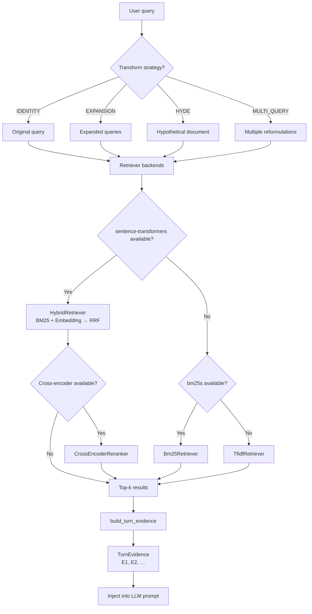

# RAG retrieval

The RAG (Retrieval-Augmented Generation) pipeline indexes armory source files into chunks, matches user queries against those chunks using sparse and/or dense retrieval, optionally re-ranks with a cross-encoder, and returns scored results that feed into the citation and study systems.

## Directory layout

```
hephaistos/harness/rag/
├── __init__.py           # public re-exports
├── chunker.py            # text chunking strategies
├── index.py              # armory index build/load/save
├── retrieve.py           # retriever backends + top-level retrieve()
├── query_transform.py    # query expansion, HyDE, multi-query
└── context.py            # TurnEvidence — citable evidence object
```

## Key abstractions

| Abstraction | Source file | Purpose |
|---|---|---|
| `Chunk` | `hephaistos/harness/rag/chunker.py` | Immutable text chunk with source, position, and heading metadata |
| `ChunkedDocument` | `hephaistos/harness/rag/chunker.py` | A file's worth of chunks plus a content hash |
| `ChunkStrategy` | `hephaistos/harness/rag/chunker.py` | Enum: `AUTO`, `MARKDOWN`, `SEMANTIC`, `TEXT` |
| `ArmoryIndex` | `hephaistos/harness/rag/index.py` | Manages chunk index per armory; build, load, save, staleness check |
| `ScoredChunk` | `hephaistos/harness/rag/retrieve.py` | A `Chunk` paired with a relevance score |
| `RetrieverProtocol` | `hephaistos/harness/rag/retrieve.py` | Minimal interface: `retrieve(query, top_k) -> list[ScoredChunk]` |
| `RerankerProtocol` | `hephaistos/harness/rag/retrieve.py` | Post-retrieval re-ranking interface |
| `TransformStrategy` | `hephaistos/harness/rag/query_transform.py` | Enum: `IDENTITY`, `HYDE`, `MULTI_QUERY`, `EXPANSION` |
| `TurnEvidence` | `hephaistos/harness/rag/context.py` | Frozen tuple of `EvidenceChunk` items with stable IDs (`E1`, `E2`, …) |

## How it works

### Chunking

`chunk_file()` in `hephaistos/harness/rag/chunker.py` reads a source file and splits it into `Chunk` objects. The strategy is selectable:

- **AUTO** (default): Markdown files get heading-aware chunking; other text files use semantic chunking (embedding-based sentence grouping), falling back to fixed-window.
- **MARKDOWN**: Splits on `#` heading boundaries, then by paragraphs within oversized sections. Each chunk carries `heading` and `heading_level` metadata.
- **SEMANTIC**: Embeds sentences via `sentence-transformers`, merges at cosine-similarity breakpoints. Falls back to fixed-window when the library is unavailable.
- **TEXT**: Fixed-window with paragraph → newline → sentence → hard-cut boundary detection.

Binary documents (PDF, DOCX, PPTX, etc.) are converted to Markdown via **docling** when the `docling` optional extra is installed, then chunked with the Markdown strategy.

Default chunk size is 500 characters with 100-character overlap.

### Indexing

`ArmoryIndex` in `hephaistos/harness/rag/index.py` scans the `source/` and `library/` subdirectories of an armory. It:

1. Iterates all visible files (skipping hidden files and patterns from `.hephaistosignore`).
2. Hashes each file for incremental rebuild detection (`is_stale()`).
3. Chunks each file via `chunk_file()`.
4. Persists the index to `.hephaistos/rag_index.json` (version 3 format).

`load_or_build()` loads an existing index if it is fresh; otherwise it rebuilds from scratch. Embeddings computed during retrieval are also cached on disk keyed by content hash and model name.

### Retrieval

The top-level `retrieve()` in `hephaistos/harness/rag/retrieve.py` auto-selects the best backend:

1. **HybridRetriever** (preferred when `sentence-transformers` is available): Runs BM25 (or TF-IDF fallback) + embedding retrieval, merges with Reciprocal Rank Fusion (RRF), then applies a cross-encoder re-ranker.
2. **Bm25Retriever**: BM25 sparse scoring via `bm25s`.
3. **TfidfRetriever**: Pure-stdlib or scikit-learn TF-IDF cosine similarity (always available as the baseline).

The pipeline applies an optional minimum score threshold (`min_score`) to filter out low-relevance results.

### Query transformation

Before retrieval, queries can be transformed via `hephaistos/harness/rag/query_transform.py`:

| Strategy | How it works | LLM required? |
|---|---|---|
| `IDENTITY` | Pass-through | No |
| `EXPANSION` | Keyword expansion via synonym map + NLTK WordNet | No |
| `HYDE` | Generates a hypothetical answer document, uses that for retrieval | Yes |
| `MULTI_QUERY` | Generates 3 alternative query phrasings, retrieves for each, fuses with RRF | Yes |

LLM-based strategies degrade gracefully to identity when no prompt function is available.

### Context building

`build_turn_evidence()` in `hephaistos/harness/rag/context.py` takes scored chunks and produces a `TurnEvidence` object — an ordered tuple of `EvidenceChunk` items with stable IDs (`E1`, `E2`, …). It respects a token budget, truncating the last included chunk if needed. `TurnEvidence.render()` produces the prompt block that instructs the model to cite evidence IDs.

## Pipeline flow



## Integration points

- **Citation verification**: `TurnEvidence` is passed to `verify_response()` in `hephaistos/harness/citation.py`. See [citation verification](citation-verification.md).
- **Study loop**: The orchestrator calls `retrieve()` when building turn evidence for study retrieval queries. See [study loop](study-loop.md).
- **Orchestrator**: `hephaistos/chat/orchestrator.py` resolves turn evidence via `_build_turn_evidence_from_query()` and `_build_turn_evidence_from_refs()`.
- **Memory system**: Retrieved source refs are passed to `extract_and_store()` as context. See [memory system](memory-system.md).

## Key source files

| File | Lines | Responsibility |
|---|---|---|
| `hephaistos/harness/rag/retrieve.py` | ~930 | Retriever backends, RRF fusion, cross-encoder re-ranking |
| `hephaistos/harness/rag/chunker.py` | ~500 | Chunking strategies, Docling integration |
| `hephaistos/harness/rag/index.py` | ~340 | Index build/load/save, staleness detection |
| `hephaistos/harness/rag/query_transform.py` | ~300 | HyDE, multi-query, expansion transformers |
| `hephaistos/harness/rag/context.py` | ~130 | `TurnEvidence`, evidence ID assignment, prompt rendering |

## Optional dependency groups

| Group | Provides | Install |
|---|---|---|
| `rag` | `bm25s`, `sentence-transformers`, `scikit-learn` | `uv sync --group rag` |
| `docling` | PDF/DOCX/PPTX conversion to Markdown | `uv sync --group docling` |

## Entry points for modification

- Add a new chunking strategy: implement a function with the `(text, source, chunk_size, overlap) -> list[Chunk]` signature and register it in `_resolve_strategy()` in `hephaistos/harness/rag/chunker.py`.
- Add a new retriever backend: implement `RetrieverProtocol` and wire it into `_create_retriever()` in `hephaistos/harness/rag/retrieve.py`.
- Add a new query transform: implement `QueryTransformerProtocol` and add a `TransformStrategy` enum value in `hephaistos/harness/rag/query_transform.py`.
