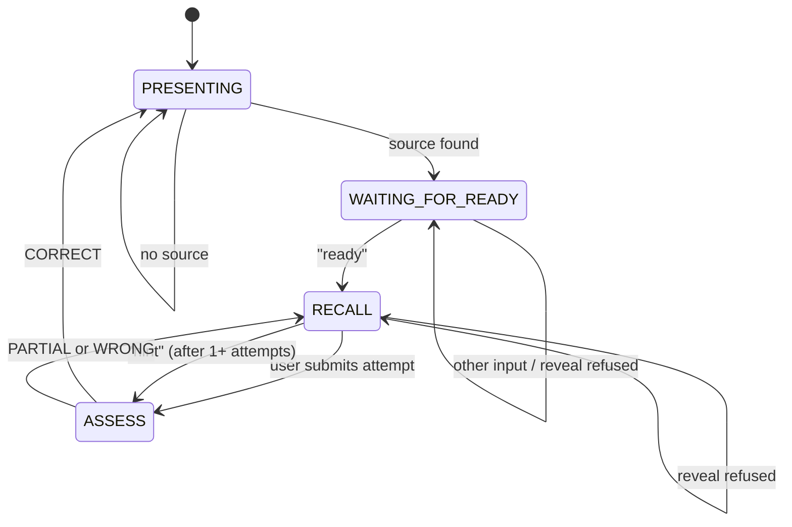

# Study loop

The study loop is a deterministic state machine that drives active recall sessions. It follows a **recall-first philosophy**: present material, ask the user to reproduce it from memory, assess the attempt, and give hints only when needed. The controller never reveals the full answer unless the user has already attempted recall.

## Purpose

Structure LLM-powered study sessions so the user actively recalls material rather than passively reading. The controller enforces discipline: no premature reveals, source-grounded assessments, and progressive hints.

## Directory layout

```
hephaistos/study/
├── __init__.py
├── controller.py          # plan_turn(), apply_turn_result()
└── state.py               # StudyState, StudyPhase, StudyAction, StudyFeedbackType
```

## Key abstractions

| Abstraction | Source file | Purpose |
|---|---|---|
| `StudyState` | `hephaistos/study/state.py` | Persistent state: phase, current item, attempt count, expected source refs |
| `StudyPhase` | `hephaistos/study/state.py` | Enum: `PRESENTING`, `WAITING_FOR_READY`, `RECALL`, `ASSESS` |
| `StudyAction` | `hephaistos/study/state.py` | Enum: `PRESENT`, `WAIT_READY_REMINDER`, `PROMPT_RECALL`, `ASSESS`, `REFUSE_REVEAL`, `HINT` |
| `StudyFeedbackType` | `hephaistos/study/state.py` | Enum: `NONE`, `NO_SOURCE`, `PRESENTED`, `WAITING`, `READY`, `REFUSED`, `HINT`, `CORRECT`, `PARTIAL`, `WRONG` |
| `StudyTurnPlan` | `hephaistos/study/controller.py` | Controller output for a single user turn: action, phase, prompt, retrieval query |
| `plan_turn()` | `hephaistos/study/controller.py` | Deterministic planning: maps (state, user input) → `StudyTurnPlan` |
| `apply_turn_result()` | `hephaistos/study/controller.py` | Advances the state machine after the model replies |

## How it works

### Phase flow



### The recall-first philosophy

1. **Present**: The controller retrieves source material and presents a concise solution or method, citing source files. It ends with *"Say ready when you want recall."*
2. **Wait for ready**: The user studies the material. Any attempt to get the answer early is refused.
3. **Recall**: The user reproduces the solution from memory. The controller does not answer or reveal content.
4. **Assess**: The LLM evaluates the attempt against retrieved source material. It must start with `CORRECT:`, `PARTIAL:`, or `WRONG:` followed by a single sentence.
5. **Hints**: Available only after the first failed attempt. The controller gives exactly one first-step hint without revealing later steps.

### Planning: `plan_turn()`

The controller is entirely deterministic. It takes the current `StudyState` and the user's input text, then:

- If no current item exists (or user says "skip"): plan a `PRESENT` action with a retrieval query.
- If in `WAITING_FOR_READY` phase: check for "ready", "reveal", or fallback to a reminder.
- If in `RECALL` phase: check for "reveal" (refuse), "hint" (give hint after 1+ attempts), or default to `ASSESS`.

Each `StudyTurnPlan` includes a structured prompt that constrains the LLM's behavior, a retrieval query for RAG, and flags for tool access.

### Advancing state: `apply_turn_result()`

After the model replies, `apply_turn_result()` parses the response and advances the state:

- **PRESENT** with source refs → `WAITING_FOR_READY` phase, set `expected_source_refs`.
- **PRESENT** without source refs → stay in `PRESENTING`, clear item.
- **PROMPT_RECALL** → `RECALL` phase.
- **ASSESS** → Parse `CORRECT`/`PARTIAL`/`WRONG` prefix. On `CORRECT`, clear item and return to `PRESENTING`. Otherwise, stay in `RECALL`.
- **HINT** → `RECALL` phase (ready for next attempt).

### Assessment parsing

The model must start its reply with exactly one of: `CORRECT:`, `PARTIAL:`, or `WRONG:`. `_parse_assessment_reply()` extracts the label and strips the prefix. If the prefix is missing, the reply defaults to `PARTIAL`.

### State persistence

`StudyState` serializes to/from a dict via `to_dict()` / `from_dict()`. It is stored as part of the chat session and persists across turns within a session. The `clone()` method creates a deep copy for rollback scenarios.

## Integration points

- **Orchestrator**: `hephaistos/chat/orchestrator.py` calls `plan_turn()` to decide each turn's action, then `apply_turn_result()` to advance state.
- **RAG retrieval**: The `StudyTurnPlan.retrieval_query` triggers retrieval; see [RAG retrieval](rag-retrieval.md).
- **Citation verification**: Assessments use source-grounded context; see [citation verification](citation-verification.md).

## Key source files

| File | Responsibility |
|---|---|
| `hephaistos/study/controller.py` | `plan_turn()`, `apply_turn_result()`, assessment parsing |
| `hephaistos/study/state.py` | `StudyState`, `StudyPhase`, `StudyAction`, `StudyFeedbackType` |
| `hephaistos/chat/orchestrator.py` | Integration — resolves study plans, builds turn evidence, finalizes turns |

## Entry points for modification

- Add a new phase: add it to `StudyPhase` in `hephaistos/study/state.py`, then add handling in `plan_turn()` and `apply_turn_result()` in `hephaistos/study/controller.py`.
- Change assessment labels: update `_ASSESS_PREFIX_RE` and `_parse_assessment_reply()` in `hephaistos/study/controller.py`.
- Add new user-intent detection: add regex patterns in `hephaistos/study/controller.py` (e.g. `_READY_RE`, `_SKIP_RE`).
