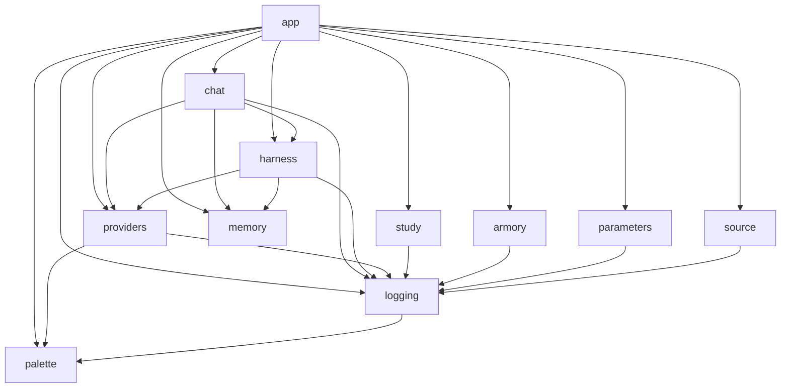
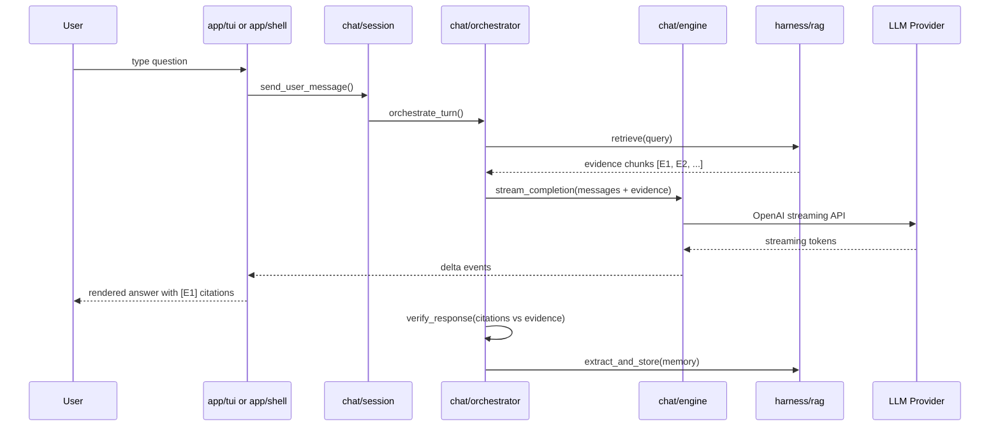

# Architecture

Hephaistos is a single-package Python application with strict import boundaries enforced by `import-linter`. Only `app` may import from other packages; all other packages are forbidden from importing `app`.

## Package layout

```
hephaistos/
  app/          CLI shell, commands, TUI, workspace — the top layer
  chat/         Engine, orchestrator, session, storage — LLM communication
  harness/      Prompt building, persona, citation, RAG, tools — agent loop
  armory/       Armory creation, validation, storage
  study/        Study session state machine and controller
  memory/       Per-armory concept extraction and persistence
  vocab/        Vocabulary drill with spaced repetition
  providers/    Multi-provider LLM configuration, OAuth, model registry
  parameters/   Cross-session settings and feature flags
  source/       Source document CLI commands
  logging.py    Structured logging with secret redaction
  observability.py  Local diagnostics and optional crash reporting
  telemetry.py  Telemetry consent and configuration
  analytics.py  PostHog event capture (opt-in)
  palette.py    Low-level ANSI color primitives
  fuzzy.py      Fuzzy matching helpers
```

## Dependency flow



Only **app** sits at the top. Every other package communicates through public APIs and never imports `app`. External services (LLM providers, OS keyring) are accessed through the **providers** and **harness** layers.

## Data flow: question to answer



## Import boundary rules

Enforced by `import-linter` in `pyproject.toml`:

| Rule | Description |
|------|-------------|
| `logging` must not import `app` | Logging is infrastructure; it cannot depend on UI |
| Non-app packages must not import `app` | All packages except `app` are isolated |
| `app.commands` must not import `app.shell` | Commands stay decoupled from the shell |
| `chat.session` and `chat.orchestrator` are independent | No circular dependencies in chat |

## Entry points

The package registers two CLI entry points in `pyproject.toml`:

```toml
[project.scripts]
hephaistos = "hephaistos.app.cli:main"
heph = "hephaistos.app.cli:main"
```

Both resolve to `hephaistos/app/cli.py:main()`, which parses arguments and dispatches to either the Textual TUI (`hephaistos/app/tui.py`) or the prompt-toolkit shell (`hephaistos/app/shell.py`).

## Language breakdown

The codebase is 100% Python:

| Category | Files | Lines |
|----------|-------|-------|
| Source (`hephaistos/`) | 78 | 20,058 |
| Tests (`tests/`) | 61 | 14,522 |
| Total | 139 | 34,580 |
