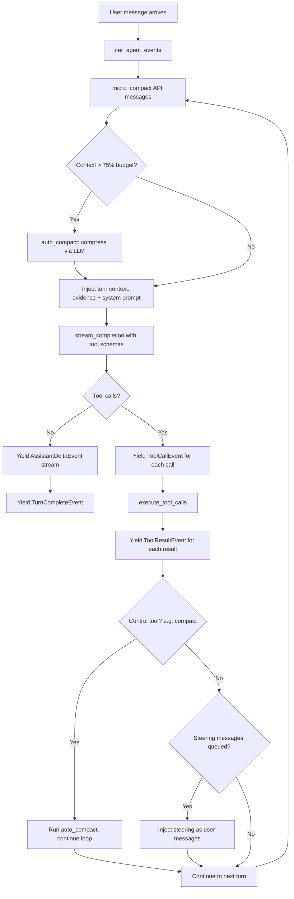

# Agent harness

The agent harness is the model/tool dispatch loop that powers Hephaistos's multi-turn reasoning. It streams LLM completions, detects tool calls, executes tools through a sandboxed registry, and manages context compaction — all while emitting structured events for the UI.

## Purpose

- Run the iterative model → tool-call → tool-result → model loop (up to `max_turns` iterations).
- Execute built-in tools (file read/write, bash, web fetch, search) and armory plugin tools.
- Inject RAG-retrieved evidence and persona-directed system prompts into each turn.
- Manage context window budget: micro-compact per turn, auto-compact when the context is 75%+ full.
- Support real-time steering via `SteeringQueue` for mid-turn user input.

## Directory layout

```
hephaistos/harness/
├── dispatch.py         # iter_agent_events(), execute_tool_calls(), SteeringQueue
├── tools.py            # ToolRegistry, ToolSpec, built-in tool handlers
├── prompt.py           # build_system_prompt(), anti-hallucination rules, tool docs
├── persona.py          # Persona definitions (drill, tutor, examiner, summarizer, debater)
├── mutation_queue.py   # FileMutationQueue — serialized file writes per workspace
├── steering.py         # Re-exports SteeringQueue
├── citation.py         # verify_response() — citation verification against evidence
├── compact.py          # auto_compact(), micro_compact() — context compression
└── rag/
    ├── __init__.py     # ArmoryIndex, TurnEvidence, retrieve(), build_turn_evidence()
    ├── context.py      # TurnEvidence rendering and scoring
    └── query_transform.py  # Query expansion, HyDE, multi-query strategies
```

## Key abstractions

| Abstraction | File | Purpose |
|---|---|---|
| `iter_agent_events()` | `hephaistos/harness/dispatch.py` | Main agent loop — yields typed `TurnEvent`s (deltas, tool calls, results, notices) |
| `ToolRegistry` | `hephaistos/harness/tools.py` | Hierarchical tool registry with parent/child scoping and plugin loading |
| `ToolSpec` | `hephaistos/harness/tools.py` | A tool: JSON schema + handler function + kind (normal/control) |
| `SteeringQueue` | `hephaistos/harness/dispatch.py` | Thread-safe queue for mid-turn user messages |
| `Persona` | `hephaistos/harness/persona.py` | Agent personality: slug, display name, role block text |
| `SystemPrompt` | `hephaistos/harness/prompt.py` | Structured system prompt with sections for role, study loop, anti-hallucination, tool docs |
| `FileMutationQueue` | `hephaistos/harness/mutation_queue.py` | Per-file locking for serialized write/edit operations |

## How it works

### Agent dispatch flow



### Turn processing details

1. **Micro-compaction**: `micro_compact()` strips empty/whitespace-only messages before each LLM call.
2. **Auto-compaction**: When `estimate_messages_tokens()` exceeds 75% of `prompt_budget`, `auto_compact()` uses the LLM to compress the conversation into a summary.
3. **Evidence injection**: `_inject_turn_context()` inserts RAG evidence and the study controller's extra system prompt right before the last user message.
4. **Tool call merging**: `merge_tool_call_deltas()` accumulates streaming tool-call deltas into complete `ToolCall` objects.
5. **Tool execution**: `execute_tool_calls()` runs each tool handler with workspace sandboxing, JSON argument parsing, and a per-turn call limit (default 5).
6. **Steering**: After each tool round, the `SteeringQueue` is drained. New user messages are injected as additional turns.

### Built-in tools

| Tool | Kind | Handler | Description |
|---|---|---|---|
| `read_file` | normal | `run_read_file` | Read file contents with optional offset/limit, 50K char cap |
| `write_file` | normal | `run_write_file` | Create/overwrite a file (routed through `FileMutationQueue`) |
| `edit_file` | normal | `run_edit_file` | Replace exact text match (routed through `FileMutationQueue`) |
| `list_files` | normal | `run_list_files` | List directory contents with optional glob filter |
| `search_files` | normal | `run_search_files` | Regex search across workspace files (50 result cap) |
| `bash` | normal | `run_bash` | Shell command execution with safety blocking, 30s timeout |
| `web_fetch` | normal | `run_web_fetch` | HTTP GET with DNS rebinding protection, HTML stripping, 20K char cap |
| `compact` | control | `_compact_handler` | Triggers conversation compaction (handled by dispatch loop) |

### Tool security

- **Path sandboxing**: `safe_path()` resolves paths inside the workspace and rejects traversal attempts.
- **Bash blocking**: `run_bash()` blocks destructive patterns (`rm -rf`, `mkfs`, `curl | sh`, etc.) as a best-effort safety net.
- **Web fetch SSRF protection**: `run_web_fetch()` resolves hostnames to IPs and blocks private/internal addresses.
- **Mutation queue**: Write and edit operations go through `FileMutationQueue` for per-file serialization.

### Plugin system

Armories can contribute custom tools by placing `*.py` files in `.hephaistos/tools/`. Each module must expose a `register(registry: ToolRegistry) -> None` function. Plugins are loaded via `ToolRegistry.load_plugins()` with symlink escape protection.

### Persona system

Five built-in personas are defined in `hephaistos/harness/persona.py`:

| Persona | Slug | Style |
|---|---|---|
| Drill Engine | `drill` | Terse, evidence-based, no praise (default) |
| Tutor | `tutor` | Patient, step-by-step explanations |
| Examiner | `examiner` | Strict pass/partial/fail grading |
| Summarizer | `summarizer` | Concise structured summaries |
| Debater | `debater` | Socratic questioning, challenges assumptions |

Personas only affect the role block in the system prompt. The study loop, anti-hallucination rules, tool docs, and format rules remain unchanged.

### System prompt

`build_system_prompt()` in `hephaistos/harness/prompt.py` assembles six sections:
1. **Role**: Persona-specific personality block (overridable via `.hephaistos/system_prompt.md`).
2. **Study loop**: The PRESENT → READY → RECALL → ASSESS cycle.
3. **Anti-hallucination**: Eight mandatory accuracy rules (never fabricate, cite evidence IDs, verify before correcting).
4. **Tool docs**: Auto-generated from tool schemas.
5. **Format rules**: Direct style, no greetings, LaTeX for math, numbered steps.
6. **Context**: Current date, armory path, source file list, memory context.

## Integration points

- **Session management** (`hephaistos/chat/session.py`): Creates `SteeringQueue`, loads armory tool plugins, and passes the session to the orchestrator.
- **Turn orchestrator** (`hephaistos/chat/orchestrator.py`): Calls `iter_agent_events()` with resolved turn evidence and study plan.
- **Chat engine** (`hephaistos/chat/engine.py`): `stream_completion()` is called for each LLM turn.
- **RAG** (`hephaistos/harness/rag/`): `TurnEvidence` is injected into messages before the LLM call.
- **Memory** (`hephaistos/memory/`): Memory context is included in the system prompt; memory extraction runs post-turn.
- **Study controller** (`hephaistos/study/`): `StudyTurnPlan` provides the extra system prompt and controls tool availability.

## Key source files

| File | Lines | Role |
|---|---|---|
| `hephaistos/harness/dispatch.py` | ~750 | Agent loop, tool execution, steering, context management |
| `hephaistos/harness/tools.py` | ~795 | Tool registry, built-in tool handlers, plugin loading |
| `hephaistos/harness/prompt.py` | ~270 | System prompt builder, anti-hallucination rules |
| `hephaistos/harness/persona.py` | ~180 | Persona definitions and resolution |
| `hephaistos/harness/mutation_queue.py` | ~120 | Per-file write serialization |
| `hephaistos/harness/steering.py` | ~10 | Re-exports SteeringQueue |
| `hephaistos/harness/compact.py` | ~230 | Auto/micro compaction |
| `hephaistos/harness/citation.py` | ~150 | Citation verification |

## Entry points for modification

- **Add a built-in tool**: Define the schema with `_tool()`, write the handler, add to `_BUILTIN_SCHEMAS` and `_HANDLERS` in `hephaistos/harness/tools.py`.
- **Add a persona**: Define a `Persona` and call `_register()` in `hephaistos/harness/persona.py`.
- **Change the study loop**: Edit `_STUDY_LOOP` in `hephaistos/harness/prompt.py`.
- **Change context compaction thresholds**: Edit the 75% threshold in `iter_agent_events()` in `hephaistos/harness/dispatch.py`.
- **Change tool call limits**: Edit `_MAX_TOOL_CALLS_PER_TURN` in `hephaistos/harness/dispatch.py`.
