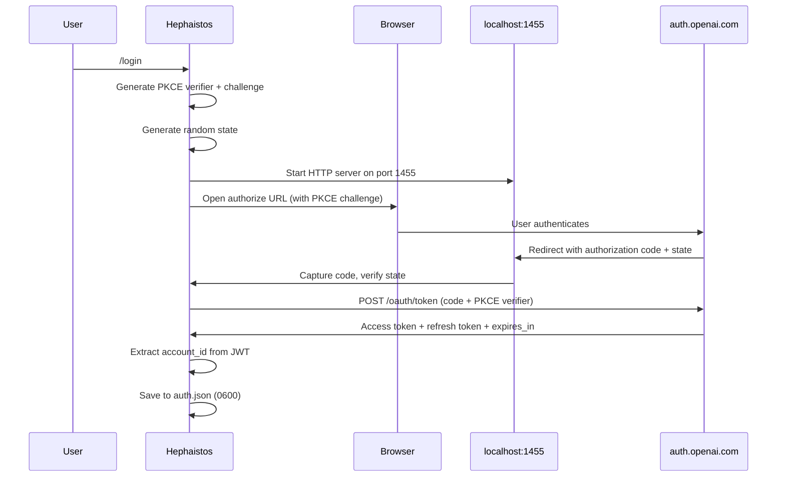

# Authentication

Hephaistos supports OAuth-based authentication for subscription-based LLM providers (currently OpenAI Codex / ChatGPT Plus/Pro). The OAuth flow uses the Authorization Code + PKCE pattern, stores tokens securely on disk, and auto-refreshes them when expired. OAuth tokens are transparently integrated into the key resolution chain.

## Purpose

- Allow users to authenticate with OpenAI Codex using their ChatGPT subscription (no API key needed).
- Store tokens securely in `~/.config/hephaistos/auth.json` with `0600` file permissions.
- Auto-refresh access tokens when they expire.
- Integrate transparently with `resolve_key()` so OAuth tokens are used automatically when the active provider has stored credentials.

## Directory layout

```
hephaistos/providers/
├── oauth.py            # OAuth flow: login, refresh, credential storage
├── keyring_store.py    # resolve_key() — OAuth tokens checked at step 2 of resolution chain
├── config.py           # Provider definitions (see provider-config.md)
└── ...
```

## Key abstractions

| Abstraction | File | Purpose |
|---|---|---|
| `OAuthCredentials` | `hephaistos/providers/oauth.py` | Dataclass: provider, access_token, refresh_token, expires_at (ms), account_id |
| `login_openai_codex()` | `hephaistos/providers/oauth.py` | Runs the full OAuth Authorization Code + PKCE flow |
| `refresh_credentials()` | `hephaistos/providers/oauth.py` | Refreshes an expired token and persists the new credentials |
| `resolve_oauth_key()` | `hephaistos/providers/oauth.py` | Returns a fresh access token for a provider slug (called by `resolve_key()`) |
| `load_credentials()` | `hephaistos/providers/oauth.py` | Loads credentials from disk with auto-refresh, cached in-process |

## How it works

### OAuth flow (OpenAI Codex)



### Step-by-step

1. **PKCE generation**: `generate_pkce()` creates a cryptographically random verifier and computes the SHA-256 challenge (S256).
2. **Callback server**: `_start_callback_server()` starts a local HTTP server on `127.0.0.1:1455`. If the port is unavailable, falls back to manual URL paste.
3. **Browser redirect**: The user's browser opens the OpenAI authorize URL with the PKCE challenge, client ID, scope, and state.
4. **Code exchange**: On callback, the authorization code is exchanged for tokens via `_exchange_code()`, which POSTs to `https://auth.openai.com/oauth/token`.
5. **JWT parsing**: `_extract_account_id()` decodes the JWT payload to extract the ChatGPT account ID.
6. **Token persistence**: `save_credentials()` writes to `~/.config/hephaistos/auth.json` with `0o600` permissions and `o_nokey` directory permissions (`0o700`).

### Token refresh

`load_credentials(provider)` handles auto-refresh:

1. Check in-process cache (`_creds_cache`). If not expired, return immediately.
2. Load from `auth.json`. If the token is expired, call `refresh_credentials()` which POSTs the refresh token to the token endpoint.
3. If refresh fails, return `None` (the key resolution chain continues to the next fallback).

### Integration with key resolution

`resolve_oauth_key(slug)` is called at step 2 of the key resolution chain in `hephaistos/providers/keyring_store.py`:

```
HEPHAISTOS_API_KEY env → OS keychain → OAuth token → Provider env var → Volatile store
```

This means OAuth tokens are used transparently — when the active provider is `openai-codex` and OAuth credentials exist, `resolve_key()` returns the fresh access token without any additional configuration.

### Shell commands

| Command | Action |
|---|---|
| `/login` | Start the OAuth login flow for the active provider |
| `/logout` | Clear stored OAuth credentials |

### Security measures

- **PKCE**: Prevents authorization code interception attacks.
- **State parameter**: Random hex string verified on callback to prevent CSRF.
- **File permissions**: `auth.json` is written with `0600` (owner read/write only). The config directory is `0700`.
- **Token storage**: Tokens are stored locally, never sent to any server other than the OAuth provider.
- **SSL verification**: `_ssl_context()` uses `certifi` CA bundle for reliable certificate verification on macOS.
- **No key logging**: Access tokens are never logged. `mask_key()` is used for display.

### Manual fallback

If the local callback server cannot start (port 1455 unavailable), the flow falls back to manual mode:
1. The authorize URL is printed to the terminal.
2. The user opens it in their browser.
3. After authentication, the user pastes the full redirect URL back into Hephaistos.
4. The code is extracted from the URL and exchanged normally.

## Integration points

- **Key resolution** ([provider-config.md](provider-config.md)): `resolve_key()` calls `resolve_oauth_key()` at step 2.
- **Chat engine** ([chat-engine.md](chat-engine.md)): `ChatConfig.resolved_api_key` eventually calls `resolve_key()`.
- **Shell commands** (`hephaistos/app/shell.py`): `/login` and `/logout` commands trigger the OAuth flow.

## Key source files

| File | Lines | Role |
|---|---|---|
| `hephaistos/providers/oauth.py` | ~460 | OAuth flow, token exchange, persistence, auto-refresh |
| `hephaistos/providers/keyring_store.py` | ~120 | Key resolution chain (calls `resolve_oauth_key()`) |

## Entry points for modification

- **Add OAuth for another provider**: Add new constants (`_CLIENT_ID`, `_AUTHORIZE_URL`, `_TOKEN_URL`), create a login function, and update `resolve_oauth_key()`.
- **Change token storage format**: Edit `save_credentials()` and `_load_all()` in `hephaistos/providers/oauth.py`.
- **Change the callback port**: Edit `_CALLBACK_PORT` and `_REDIRECT_URI` in `hephaistos/providers/oauth.py`.
