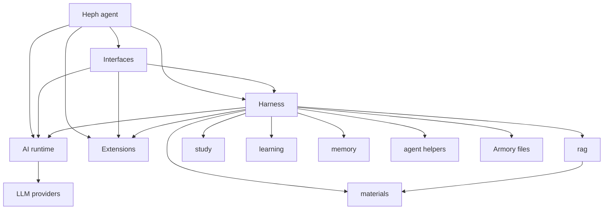

# Package Map

This is the ownership map for the five workspace packages. It is meant to be a
quick compass for humans and coding agents before changing package boundaries.

```text
packages/
  ai/
    src/ai/
      diagnostics/  Metrics and tracing primitives
      logging/      Structured logging, redaction, and timers
      providers/    LLM provider registry, config, auth, model catalogs
      runtime/      Chat config, messages, streaming, retry, usage
      types/        Narrow payload type helpers
    test/
  extensions/
    src/extensions/
      contracts.py  Stable extension contracts
    test/
  heph/
    src/heph/
      cli/        Console entrypoint and top-level subcommands
      commands/   Slash-command registry and command coordinators
      sdk/        Programmatic runtime/session surface for native apps and automation
      product/    Temporary self-knowledge bridge
      identity/   Stable self-description and conversational identity target
      prompts/    Prompt programs treated as code
      state/      Declarative JSON/Markdown state contract target
    test/
  hephaion/
    src/hephaion/
      agent/       Prompt building, citation, tool registry/handlers
      armory/      Armory data, validation, discovery, and local state helpers
      chat/        Session lifecycle, intent contracts, evidence, turn orchestration
      diagnostics/ Anonymous events, local diagnostics, redacted crash reports
      learning/    Structural answer-attempt observations and static guard policy
      matching/    Fuzzy matching helpers for human-facing selectors
      materials/   Study-file discovery, ignore rules, and material role classification
      memory/      Memory extraction and storage
      parameters/  Parameter management and settings
      privacy/     Consent, anonymous install ID, release-time diagnostics config
      rag/         RAG chunking, indexing, retrieval, source mapping
      safety/      Local safety contracts
      study/       Prompt plans, recall controller, priority analysis
      version/     Package version helpers
      vocab/       Vocabulary drill, scheduler, state
    test/
  interfaces/
    src/interfaces/
      palette/   Theme and ANSI color tokens
      terminal/  Terminal I/O, styling, prompts, history, source opening
      tui/       Textual adapter: lifecycle, widgets, inline menus, rendering
    test/
```



Core invariants:

- `ai.*` is provider and model API substrate. It should almost never change for
  Heph-specific behavior.
- `hephaion.*` is the harness implementation namespace: guardrails, armories,
  retrieval, citations, memory, local learning, diagnostics, and session state.
- Heph owns the `heph` command, SDK surface, agent identity, and composition of
  the lower packages.
- Interfaces and Extensions compose the core through public contracts instead
  of owning harness or agent behavior.
